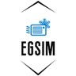

<!-- PROJECT SHIELDS -->
<!--
*** I'm using markdown "reference style" links for readability.
*** Reference links are enclosed in brackets [ ] instead of parentheses ( ).
*** See the bottom of this document for the declaration of the reference variables
*** for contributors-url, forks-url, etc. This is an optional, concise syntax you may use.
*** https://www.markdownguide.org/basic-syntax/#reference-style-links
-->
[![Contributors][contributors-shield]][contributors-url]
[![Forks][forks-shield]][forks-url]
[![Stargazers][stars-shield]][stars-url]
[![Issues][issues-shield]][issues-url]
[![MIT License][license-shield]][license-url]


<!-- PROJECT LOGO -->
<br />
<div align="center">
  <a href="https://github.com/OmarZaki96/EGSim">
    
  </a>

<h3 align="center">EGSim</h3>

  <p align="center">
    <br />
    <a href="https://github.com/OmarZaki96/EGSim/"><strong>Explore the docs »</strong></a>
    <br />
    <br />
    <a href="https://github.com/OmarZaki96/EGSim/issues">Report Bug</a>
    ·
    <a href="https://github.com/OmarZaki96/EGSim/issues">Request Feature</a>
  </p>
</div>


<!-- TABLE OF CONTENTS -->
<details>
  <summary>Table of Contents</summary>
  <ol>
    <li>
      <a href="#about-the-project">About The Project</a>
    </li>
    <li>
      <a href="#getting-started">Getting Started</a>
      <ul>
        <li><a href="#prerequisites">Prerequisites</a></li>
        <li><a href="#installation">Installation</a></li>
      </ul>
    </li>
    <li><a href="#usage">Usage</a></li>
    <li><a href="#roadmap">Roadmap</a></li>
    <li><a href="#contributing">Contributing</a></li>
    <li><a href="#license">License</a></li>
    <li><a href="#contact">Contact</a></li>
    <li><a href="#acknowledgments">Acknowledgments</a></li>
  </ol>
</details>


<!-- ABOUT THE PROJECT -->
## About The Project

EGSim is a vapor compression system tool developed based on physics-based simulation for typical mini-split air conditioning systems comprised of a compressor, discharge line, condenser, liquid line, capillary tube, 2-phase line, evaporator, and suction line. The tool was funded under support from UNIDO through the Egyptian HPMP-II.

<p align="right">(<a href="#top">back to top</a>)</p>

<!-- GETTING STARTED -->
## Getting Started


### Prerequisites

- For the compiled EXE file, all Python modules needed are already incorporated inside the compiled file
- For the Python interface, you will need to install python first. The software has been tested on python 3.8.7, but you may use the latest python version. You will also need to install the following modules for Python:
  - appdirs
  - CoolProp
  - lxml
  - matplotlib
  - numpy
  - pandas
  - PsychroLib
  - pyperclip
  - PyQt5
  - scikit_learn
  - scipy
  - sympy

  To install all the packages at once, you can use the following command 
  ```sh
  python -m pip install appdirs CoolProp lxml matplotlib numpy pandas PsychroLib pyperclip PyQt5 scikit_learn scipy sympy
  ```

### Installation

- To use the Compiled exe file, install the latest release through <a href="https://github.com/OmarZaki96/EGSim/releases">Here</a>. You might encounter an error during installation because of the admin privileges; if so, try installing the tool in somewhere else than in program files folder. 

- To use the python code instead of the compiled exe file:
  1. Create the folder `%USERNAME%\appdata\Local\EGSim`
  2. Copy EGSim folder in the repository inside the created folder, so that the path would be `%USERNAME%\appdata\Local\EGSim\EGSim`

<p align="right">(<a href="#top">back to top</a>)</p>

<!-- ROADMAP -->
## Roadmap

See the [open issues](https://github.com/github_username/repo_name/issues) for a full list of proposed features (and known issues).

<p align="right">(<a href="#top">back to top</a>)</p>

<!-- CONTRIBUTING -->
## Contributing

Contributions are what make the open source community such an amazing place to learn, inspire, and create. Any contributions you make are **greatly appreciated**.

If you have a suggestion that would make this better, please fork the repo and create a pull request. You can also simply open an issue with the tag "enhancement".
Don't forget to give the project a star! Thanks again!

1. Fork the Project
2. Create your Feature Branch (`git checkout -b feature/AmazingFeature`)
3. Commit your Changes (`git commit -m 'Add some AmazingFeature'`)
4. Push to the Branch (`git push origin feature/AmazingFeature`)
5. Open a Pull Request

<p align="right">(<a href="#top">back to top</a>)</p>


<!-- LICENSE -->
## License
Distributed under the CC BY-NC-ND License. See `LICENSE.md` for more information.

<p align="right">(<a href="#top">back to top</a>)</p>


<!-- CONTACT -->
## Contact

Omar Zaki - Omar.Zaki9696@gmail.com

Omar Abdelaziz, PhD - Omar.abdel.aziz@gmail.com - omar_abdelaziz@aucegypt.edu

Project Link: [https://github.com/OmarZaki96/EGSim](https://github.com/OmarZaki96/EGSim)

<p align="right">(<a href="#top">back to top</a>)</p>

<!-- ACKNOWLEDGMENTS -->
## Acknowledgments

I learned a lot from the tool created by <a href="https://github.com/ibell">Dr. Ian Bell</a>, which is <a href="https://github.com/CenterHighPerformanceBuildingsPurdue/ACHP">ACHP</a>.

<p align="right">(<a href="#top">back to top</a>)</p>

<!-- MARKDOWN LINKS & IMAGES -->
<!-- https://www.markdownguide.org/basic-syntax/#reference-style-links -->
[contributors-shield]: https://img.shields.io/github/contributors/OmarZaki96/EGSim.svg?style=for-the-badge
[contributors-url]: https://github.com/OmarZaki96/EGSim/graphs/contributors
[forks-shield]: https://img.shields.io/github/forks/OmarZaki96/EGSim.svg?style=for-the-badge
[forks-url]: https://github.com/OmarZaki96/EGSim/network/members
[stars-shield]: https://img.shields.io/github/stars/OmarZaki96/EGSim.svg?style=for-the-badge
[stars-url]: https://github.com/OmarZaki96/EGSim/stargazers
[issues-shield]: https://img.shields.io/github/issues/OmarZaki96/EGSim.svg?style=for-the-badge
[issues-url]: https://github.com/OmarZaki96/EGSim/issues
[license-shield]: https://img.shields.io/github/license/OmarZaki96/EGSim.svg?style=for-the-badge
[license-url]: https://github.com/OmarZaki96/EGSim/blob/master/LICENSE.txt
[product-screenshot]: photos/Large_icon.png
